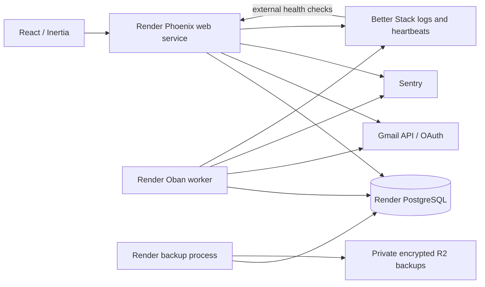

# ADR-0001: Elixir application on Render

Hosting decision superseded by [ADR-0002](0002-exe-vm-hosting.md). The original rationale below is retained as history.

## Status

Accepted stack decision, 2026-09-04. The operating defaults below are proposed starting points to validate in Phase 0; they are not completed infrastructure or proven reliability claims.

The [product specification](../email-client-product-implementation-spec.md) defines behavior. The [Phase 0 plan](../phase-0-gmail-reliability-proof.md) defines the evidence required before full implementation. Earlier Laravel research records alternatives, not the selected architecture.

## Context

Start with one person and one Gmail account. Build a personal email client that can later become a commercial product if dogfood proves valuable. Safety takes priority over UI completeness: mail must remain discoverable, release batches must stay finite, and failures must not silently trap mail or duplicate sends.

The owner prefers Elixir and wants managed hosting without directly operating a major-cloud infrastructure stack. Render is the selected deployment platform throughout development, testing, and production. Gmail still requires a Google API project and OAuth configuration.

## Decision

| Responsibility | Selection | Reason |
|---|---|---|
| Application server | Elixir / Phoenix | One application for authenticated requests, domain orchestration, and long-running integration work |
| Domain and persistence | Ash / AshPostgres / PostgreSQL | Explicit actions, validation, policies, and transactional workflow state |
| Browser UI | React / TypeScript / Inertia | React interaction model with server-driven routes and session authentication |
| Durable jobs | Oban | PostgreSQL-backed execution without adding Redis or a separate message broker |
| Hosting | Render | Managed deployment and database operations |
| Database recovery | Render recovery plus encrypted exports to Cloudflare R2 | Fast platform recovery plus a separate copy under our control |
| Application errors | Sentry | Phoenix/Oban and React error diagnosis |
| Operational monitoring | Better Stack | External uptime, missed heartbeats, operational alerts, and Render log collection |

Use a modular monolith: one repository, one application release, and one primary database per environment. Deploy that release in separate web and worker roles. Do not introduce microservices, a separate public API, Redis, or a search cluster for the personal MVP.

## Runtime and deployment

Proposed baseline:

- Paid, always-running web and worker services, with managed PostgreSQL in the same Render region. Select region and instance sizes before provisioning; record the resulting monthly budget.
- Web serves requests and enqueues durable work. Worker executes normal Oban queues. Neither role relies on an in-memory timer for durable delivery deadlines.
- Keep a recovery execution path independent of normal queue progress. It must serialize against normal work, disable interception, and run resumable recovery even when a normal queue is stuck.
- Separate deployed development/test and production environments: databases, OAuth clients, tokens, application keys, backup destinations, and monitoring identifiers. Use synthetic mail in development; do not copy personal production mail into it.
- Local development remains possible; all hosted environments use Render. exe.dev is outside this architecture.
- Build one immutable release with frontend assets. Run migrations once per deployment. Use compatible migrations so old and new processes can briefly coexist. Document rollback limits before any destructive migration.
- Pin compatible dependency versions when scaffolding. Prove Phoenix/Inertia/React navigation, forms, CSRF handling, and error integration in a small vertical slice before investing in the Room.

## Application boundaries and state ownership

| Boundary | Owns |
|---|---|
| Accounts | Allowed identity, Gmail connection, encrypted tokens, receiving/sending identities, connection health |
| Mail integration | Gmail HTTP calls, history cursor, message metadata, app-owned Gmail resource identifiers, reconciliation |
| Delivery | Windows, due occurrences, immutable batch membership, per-message release progress, recovery mode |
| Workflow | Classification, rule explanations, per-batch review state, work status, horizons, Keep |
| Compose | Draft persistence, send intent, send outcome, explicit post-send disposition |
| Operations | Sanitized audit events, health state, backup status, recovery controls |

These are responsibility boundaries within the application, not separate services. Use Ash actions for domain changes and explicit orchestration for multi-step Gmail operations. Keep Gmail I/O outside database transactions. Use database constraints and transactions for invariants; framework validations alone are insufficient under concurrency.

Gmail is authoritative for messages and external mailbox changes. PostgreSQL is authoritative for product workflow, schedules, rules, batch membership, and operation progress. Gmail labels project product state; they cannot reconstruct every workflow decision after database loss.

Represent message delivery, conversation classification, per-batch review, work status, horizon, and Keep separately. Carry account ownership through persisted records and authorization even in the single-user MVP. Do not build organizations, billing, or multi-account UX yet.

## Durable delivery and synchronization

1. Persist configured local times with an IANA timezone and durable due occurrences. A recurring job finds overdue work; the database determines what is due. Specify daylight-saving and catch-up behavior in the Phase 0 contract.
2. Serialize release creation per account in PostgreSQL. Scheduled release, Check Now, and recovery must share the same concurrency protocol across processes.
3. Atomically persist exact selected Gmail message IDs, initial item states, and execution intent before calling Gmail. Enqueue Oban work in that same database transaction where supported by the chosen integration; prove rollback behavior. Otherwise use a transactional outbox and dispatcher.
4. Release only selected message IDs. Record each result and reconcile uncertain outcomes. A retry cannot expand the batch to a newer thread reply. Oban uniqueness is supplemental; database invariants protect against duplicate or overlapping work.
5. Treat external calls as repeatable or reconcilable, never as exactly-once transactions. A crash after Gmail succeeds but before a database commit must be recoverable.
6. Start with Gmail history polling and periodic reconciliation. Polling cadence is a measured Phase 0 choice. Arrival-time Gmail filtering must do interception; polling cannot promise to prevent initial Inbox notifications. Google documents that an expired history cursor returns 404 and requires full synchronization. [Gmail synchronization](https://developers.google.com/workspace/gmail/api/guides/sync)
7. Reconciliation must tolerate mail being read, archived, moved, or deleted directly in Gmail without resurrecting it or overwriting unrelated labels. Agree the action-specific policy before implementing it.

Do not add Google Pub/Sub initially. Revisit push if measured latency or quota use warrants it; it would not replace durable reconciliation.

## Gmail access and user safety

Use server-side OAuth and allow only the configured Google identity into the personal instance. Validate the returned identity, OAuth state, and granted scopes. Keep tokens out of browser storage and Inertia props. Encrypt refresh tokens at the application layer, with recoverable keys stored separately from the database and backup objects.

Phase 0 must create a method-to-scope inventory. Reading/modifying mail and managing interception filters are distinct capabilities: filter creation requires `gmail.settings.basic`. Validate the minimum combined scope set against actual methods, including identity discovery and future sending. [Filter creation](https://developers.google.com/workspace/gmail/api/reference/rest/v1/users.settings.filters/create)

Choose independent health alerts plus tested panic/manual recovery as the initial fail-safe strategy. This does **not** make Gmail interception fail open during a Render outage. A Gmail filter may keep holding mail while every Render service is down. Better Stack must detect the missing heartbeat and reach the owner through a channel independent of intercepted Gmail; the owner must be able to recover directly in Gmail.

Panic recovery stops conflicting work and disables future interception before restoring held messages. Disconnect revokes access only after recovery is verified, unless the user explicitly accepts documented residual risk. Persist progress and permit safe repetition.

For sending, persist a draft and send intent before submission. An ambiguous timeout remains an unknown outcome until reconciliation or explicit user resolution; never blindly resend. Do not apply Done/Waiting/Keep Open as if a failed or unknown send succeeded. Full compose is later-phase work, but this contract is fixed now.

## Backups and restore

Render managed recovery is the first recovery path; encrypted logical PostgreSQL exports to a private R2 bucket provide the independent copy. Render documents plan-dependent recovery retention and restoration into a separate database. Select a plan after checking its actual recovery window; do not promise zero data loss. [Render recovery](https://render.com/docs/postgresql-backups)

Proposed starting policy:

- Daily logical export, encrypted before upload, with dated immutable object names and a manifest containing schema/release version, checksum, and completion time.
- Thirty-day retention, with bucket-lock rules tested against upload and expiry behavior. Bucket locks protect matching objects from deletion/overwrite during retention; they do not replace encryption or restore tests. [R2 bucket locks](https://developers.cloudflare.com/r2/buckets/bucket-locks/)
- Least-privilege backup credentials, no public bucket access, and a separately stored recovery copy of encryption keys. Never include keys in backup objects or logs.
- Report backup success only after upload and verification. An external heartbeat detects absence of a successful backup.
- Daily exports imply up to approximately 24 hours of workflow-state loss in the independent-copy path. Measure achievable recovery time in Phase 0 and choose an acceptable target before dogfood.
- Restore into an isolated environment with all sending, release jobs, interception changes, and other Gmail writes disabled. A restored Oban row may describe an operation Gmail already completed. Reconcile provider state and quarantine uncertain operations before resuming.
- Rehearse recovery from both Render and R2 before dogfood, then periodically and after material backup/schema changes. Verify workflow records and recovery keys, not merely whether PostgreSQL starts.

Gmail remaining available does not protect local drafts, rules, or review history from database loss. Include those records in restore assertions. This is an application-data backup strategy, not a complete Gmail mailbox archive.

## Monitoring and privacy

Sentry collects sanitized backend and React errors. Explicitly configure its Oban integration; do not assume error capture is enabled by default. It also supports cron monitoring, but Better Stack owns the operational heartbeat checks here to avoid duplicate paging. [Sentry Elixir](https://sentry.hexdocs.pm/Sentry.html)

Better Stack collects sanitized Render logs and checks:

- External application readiness, with no secrets in the response.
- Recent successful Gmail synchronization, including a valid no-change response.
- Delivery health: each expected batch is completed or explicitly resolved, with escalation by the product's 15-minute grace deadline. A scheduler tick alone is insufficient evidence.
- Successful verified backup uploads.

Prime every heartbeat and test a missing ping: Better Stack monitors remain pending until their first heartbeat. Budget checker cadence and grace together so alerts arrive within the delivery deadline. Select and test an independent notification channel before activation. [Better Stack heartbeats](https://betterstack.com/docs/uptime/cron-and-heartbeat-monitor/)

Scrub before emitting logs or SDK events. Exclude bodies, subjects, recipients, attachment names, drafts, OAuth credentials, sensitive request props, and raw Gmail error payloads. Use internal correlation IDs, counts, durations, and sanitized error codes. Disable session replay initially. Error monitoring, log access, and retention need explicit configuration and redaction tests.

## Alternatives considered

- **Laravel / React / Inertia / Laravel Cloud:** credible alternative with an integrated ecosystem; evaluated in the repository research notes. Chose the owner's preferred Elixir stack for this implementation, without claiming Laravel cannot meet the safety requirements.
- **Fly.io:** compatible with Elixir; chose Render for the intended managed operating model. No claim of inherently superior availability.
- **exe.dev and self-managed PostgreSQL:** rejected for this project to avoid owning database operations and recovery infrastructure.
- **Better Stack alone:** possible future consolidation; retain Sentry's explicit Elixir/Oban integration now. Revisit only after compatibility and diagnostic quality are demonstrated.

## Consequences and remaining decisions

We operate web and worker roles plus managed PostgreSQL, with R2, Sentry, and Better Stack as supporting services. This adds several vendor configurations, but avoids administering database VMs. External-provider failures still require application-level recovery.

Before provisioning: select region, Render service/database plans, monitoring alert channel, and budget. Before personal activation: prove recovery, settle data retention and key custody, verify OAuth authorization duration, and complete the specification's security and dogfood gates. Before commercialization: revisit tenancy isolation, onboarding/recovery support, capacity, billing, and applicable Google verification/data-use requirements. Public launch is a separate readiness decision.
